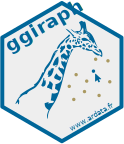

ggiraph R package
================



> Make ‘ggplot’ Graphics Interactive

[](https://travis-ci.org/davidgohel/ggiraph)
[](https://ci.appveyor.com/project/davidgohel/ggiraph/branch/master)
[](https://CRAN.R-project.org/package=ggiraph)


## Overview

`ggiraph` is an htmlwidget and a ggplot2 extension. It allows ggplot
graphics to be animated.

Animation is made with ggplot geometries that can understand three
arguments:

  - `tooltip`: column of dataset that contains tooltips to be displayed
    when mouse is over elements.
  - `onclick`: column of dataset that contains javascript function to be
    executed when elements are clicked.
  - `data_id`: column of dataset that contains id to be associated with
    elements.

If used within a shiny application, elements associated with an id
(`data_id`) can be selected and manipulated on client and server sides.


## Installation

##### Get development version on github

``` r
devtools::install_github('davidgohel/ggiraph')
```

##### Get CRAN version

``` r
install.packages("ggiraph")
```
