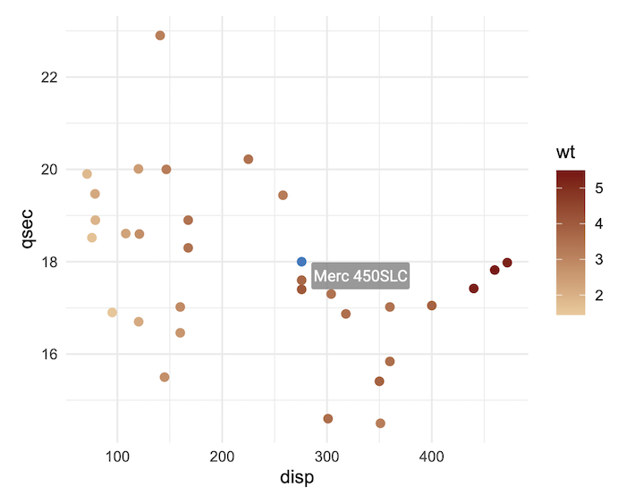
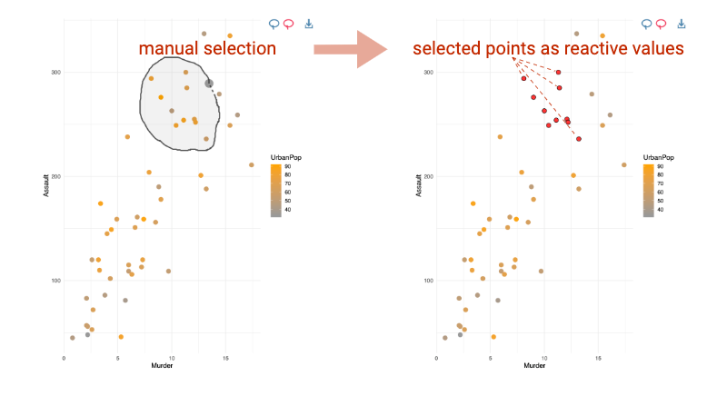

> [ggiraph](https://davidgohel.github.io/ggiraph/) makes ‘ggplot’
> graphics interactive.

## Overview

[](https://github.com/davidgohel/ggiraph/)
[ggiraph](https://davidgohel.github.io/ggiraph/) is a tool that allows
you to create dynamic ggplot graphs. This allows you to add tooltips,
hover effects and JavaScript actions to the graphics. The package also
allows the selection of graphical elements when used in shiny
applications.

Interactivity is added to ggplot **geometries, legends and theme
elements**, via the following aesthetics:

- `tooltip`: tooltips to be displayed when mouse is over elements.
- `onclick`: JavaScript function to be executed when elements are
  clicked.
- `data_id`: id to be associated with elements (used for hover and click
  actions)

### Why use `{ggiraph}`

- You want to provide your readers with more information than the basic
  information available; you can display a tooltip when the user’s mouse
  is on a graphical element, you can also visually animate elements with
  the same attribute when the mouse passes over a graphical element, and
  finally you can link a JavaScript action to the click, such as opening
  a hypertext link.
- You want to allow users of a Shiny application to select graphical
  elements; for example, you can make the points of a scatter plot
  selectable and available as a reactive value from the server part of
  your application. With Shiny,
  [ggiraph](https://davidgohel.github.io/ggiraph/) allows interaction
  with graph elements, legends elements, titles and ggplot theme
  elements from the server part; each selection is available as a
  reactive value.



> Under the hood, [ggiraph](https://davidgohel.github.io/ggiraph/) is an
> htmlwidget and a ggplot2 extension. It allows graphics to be
> interactive, by exporting them as SVG documents and using special
> attributes on the various elements.

## Usage

### With R and R Markdown

The things you need to know to create an interactive graphic :

- Instead of using `geom_point`, use `geom_point_interactive`, instead
  of using `geom_sf`, use `geom_sf_interactive`… Provide at least one of
  the aesthetics `tooltip`, `data_id` and `onclick` to create
  interactive elements.
- Call function `girafe` with the ggplot object so that the graphic is
  translated as a web interactive graphics.

``` r

library(ggplot2)
library(ggiraph)
data <- mtcars
data$carname <- row.names(data)

gg_point = ggplot(data = data) +
    geom_point_interactive(aes(x = wt, y = qsec, color = disp,
    tooltip = carname, data_id = carname)) + 
  theme_minimal()

girafe(ggobj = gg_point)
```

### With Shiny

- If used within a shiny application, elements associated with an id
  (`data_id`) can be selected and manipulated on client and server
  sides. The list of selected values will be stored in in a reactive
  value named `[shiny_id]_selected`.



### Available interactive layers

They are several available interactive geometries, scales and other
ggplot elements. Almost all ggplot2 elements can be made interactive
with [ggiraph](https://davidgohel.github.io/ggiraph/). They are all
based on their ggplot version, same goes for scales and the few guides:
[`geom_point_interactive()`](https://davidgohel.github.io/ggiraph/dev/reference/geom_point_interactive.md),
[`geom_col_interactive()`](https://davidgohel.github.io/ggiraph/dev/reference/geom_bar_interactive.md),
[`geom_tile_interactive()`](https://davidgohel.github.io/ggiraph/dev/reference/geom_rect_interactive.md),
[`scale_fill_manual_interactive()`](https://davidgohel.github.io/ggiraph/dev/reference/scale_manual_interactive.md),
[`scale_discrete_manual_interactive()`](https://davidgohel.github.io/ggiraph/dev/reference/scale_manual_interactive.md),
[`guide_legend_interactive()`](https://davidgohel.github.io/ggiraph/dev/reference/guide_legend_interactive.md),
…

You can also make interactive annotations, titles and facets (see
[`help(interactive_parameters)`](https://davidgohel.github.io/ggiraph/dev/reference/interactive_parameters.md)).

## Installation

> Get development version on github

``` r

devtools::install_github('davidgohel/ggiraph')
```

> Get CRAN version

``` r

install.packages("ggiraph")
```

## Resources

### Online documentation

The help pages are located at <https://davidgohel.github.io/ggiraph/>.

### Getting help

If you have questions about how to use the package, visit Stackoverflow
and use tags `ggiraph` and `r` [Stackoverflow
link](https://stackoverflow.com/questions/tagged/ggiraph+r)! We usually
read them and answer when possible.

## Contributing to the package

### Bug reports

Bugs are reported through [GitHub
issues](https://github.com/davidgohel/rvg/issues/new/choose). The issue
form requires a reproducible example (a
[reprex](https://reprex.tidyverse.org/)) and the output of
[`sessionInfo()`](https://rdrr.io/r/utils/sessionInfo.html); reports
missing these elements are closed without further response. The more
reproducible your report, the more time can go into investigating the
bug rather than reconstructing it.

For usage questions (“how do I do X with ggiraph”), please read
<https://ardata.fr/ggiraph-book/> or ask on [Stack
Overflow](https://stackoverflow.com/questions/tagged/r) with the `[r]`
tag instead.

### Pull requests

Before writing any code, please open an issue describing the change you
have in mind and the reason for it. The proposal needs to be discussed
and explicitly validated by the maintainer before work starts; pull
requests for features that have not gone through this step will not be
considered, no matter how well crafted. This isn’t meant to discourage
contributions, only to make sure the time you invest goes into a change
that will actually land.

Pull requests are accepted on a case-by-case basis: once a proposal has
been agreed in an issue, the maintainer will invite you to open a PR for
that specific change. Unsolicited PRs that bypass this step will be
closed.

When invited to open a PR, please include:

- the new function(s) with code and roxygen tags, including runnable
  examples
- documentation updates where relevant
- corresponding tests in directory `inst/tinytest`.

### Install from sources on macOS

Please read carefully the official R for macOS instructions:
<https://mac.r-project.org/>

To compile [ggiraph](https://davidgohel.github.io/ggiraph/) from source,
you need `libpng`. Using Homebrew is recommended:

``` R
brew install libpng
```

Then configure your `~/.R/Makevars` file with the appropriate paths. For
Apple Silicon Macs (M1/M2/M3), the typical configuration is:

``` R
CFLAGS=-I/opt/homebrew/include
CPPFLAGS=-I/opt/homebrew/include
CXXFLAGS=-I/opt/homebrew/include
CXX11FLAGS=-I/opt/homebrew/include
LDFLAGS=-L/opt/homebrew/lib
```

For Intel Macs, paths are usually `/usr/local/include` and
`/usr/local/lib` instead.

``` R
CFLAGS=-I/usr/local/include
CPPFLAGS=-I/usr/local/include
CXXFLAGS=-I/usr/local/include
CXX11FLAGS=-I/usr/local/include
LDFLAGS=-L/usr/local/lib
```

> Note: Paths may vary depending on your system configuration. We are
> unable to provide support for installation issues related to macOS
> compilation setup.
